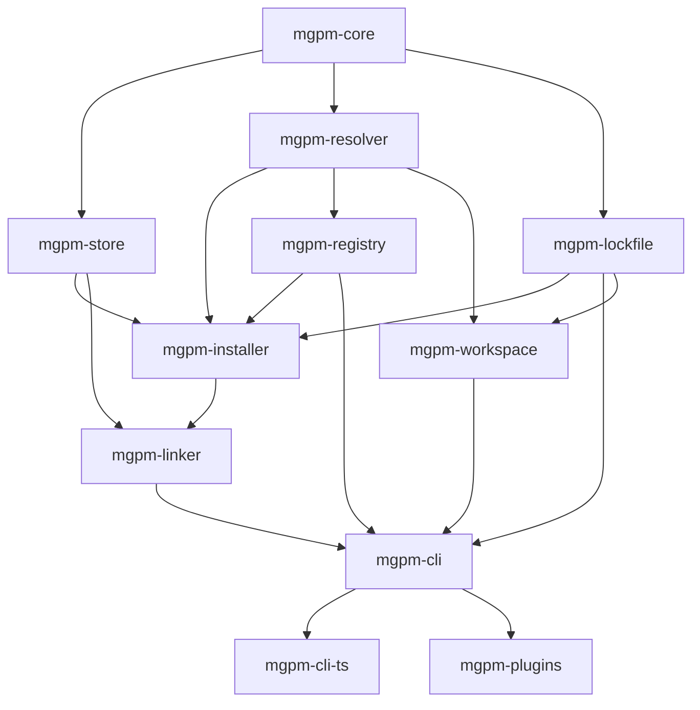

# MGPM — MegaGate Package Manager
## Blueprint: From-Zero Rust Implementation

**Objective**: Build a production-grade JavaScript/TypeScript package manager from scratch in Rust, combining the proven strengths of pnpm, bun, and Vite/Rolldown while eliminating their weaknesses.

**Constraints**:
- **Zero dependencies** on pnpm, bun, npm, yarn, Vite, Rolldown, or any existing package manager code
- **Rust-first**: Core (resolver, store, installer, linker, registry, lockfile) in pure Rust
- **TypeScript only for**: CLI command parsing, plugin API surface, output formatting
- **No Node.js runtime** in core — direct syscalls via `io_uring`/`kqueue`
- **Single binary** distribution

---

## Phase 0: Foundation & Tooling (Week 1-2)

### Step 0.1: Project Scaffold & Build System
**Context**: Set up Rust workspace with proper crate structure, CI, and development tooling.

**Tasks**:
- [ ] Create Cargo workspace with crates: `mgpm-core`, `mgpm-store`, `mgpm-resolver`, `mgpm-installer`, `mgpm-linker`, `mgpm-registry`, `mgpm-lockfile`, `mgpm-cli`, `mgpm-plugins`
- [ ] Configure `rust-toolchain.toml` (MSRV 1.78+), `cargo deny`, `cargo audit`
- [ ] Set up GitHub Actions CI: `cargo test`, `cargo clippy`, `cargo fmt`, `cargo deny`, cross-compile (linux-x64, linux-arm64, macos-x64, macos-arm64, windows-x64)
- [ ] Add `justfile`/`Makefile` for common dev tasks
- [ ] Configure `mimalloc` as global allocator
- [ ] Set up `tracing` + `tracing-subscriber` for structured logging

**Verification**:
```bash
cargo build --workspace --release
cargo test --workspace
cargo clippy --workspace -- -D warnings
cargo fmt --check
```

**Exit Criteria**: Clean build, all tests pass, CI green on all targets.

---

### Step 0.2: Core Primitives & Error Handling
**Context**: Define shared types, error hierarchy, and async runtime.

**Tasks**:
- [ ] Define `mgpm-core` crate with:
  - `PackageName`, `PackageVersion`, `PackageId`, `DependencySpec`, `Resolution`
  - `IntegrityHash` (SHA-512/384/256 + Subresource Integrity)
  - `SemVer` wrapper with `VersionSet` (range operations)
  - `PackageProtocol`: `Registry`, `Git`, `Http`, `File`, `Workspace`, `Catalog`
- [ ] Error hierarchy: `MgpmError` → `ResolveError`, `StoreError`, `NetworkError`, `LockfileError`, `ConfigError`, `PluginError`
- [ ] Async runtime: `tokio` with `io_uring` (Linux) / `kqueue` (macOS) / `IOCP` (Windows) via `tokio-uring` / `async-io`
- [ ] Global allocator: `mimalloc` with per-thread arenas
- [ ] Configuration: `mgpm.yaml` schema (workspaces, catalogs, overrides, registries, concurrency, store-path)

**Verification**:
```bash
cargo test -p mgpm-core
cargo doc -p mgpm-core --no-deps
```

**Exit Criteria**: Core types compile, docs generated, error types cover all failure modes.

---

## Phase 1: Content-Addressable Store (Week 2-3)

### Step 1.1: CAFS — Content-Addressable File System
**Context**: Implement pnpm-style CAFS but with improvements: SHA-256 (not SHA-512), reflink-first, atomic writes, SQLite index.

**Tasks**:
- [ ] `mgpm-store` crate: `ContentStore` struct
  - Storage layout: `~/.mgpm/store/files/<algo>/<first2>/<hash>` + `exec/` subdir for executables
  - Hash algorithm: **SHA-256** (faster than SHA-512, sufficient collision resistance)
  - File import methods (priority order):
    1. **Reflink** (copy-on-write): `FICLONE`/`FICLONERANGE` (Linux), `clonefile` (macOS APFS)
    2. **Hardlink**: `linkat` (same filesystem)
    3. **Copy**: `copy_file_range` (Linux) / `fcopyfile` (macOS) / `CopyFile2` (Windows)
  - Atomic write: temp file + `renameat2`/`MoveFileEx`
  - **No silent fallback** — log exact reason for each method choice/fallback
- [ ] SQLite index (`rusqlite` + `libsql`):
  - `files` table: `hash PRIMARY KEY, size, ref_count, executable, created_at`
  - `packages` table: `package_id PRIMARY KEY, name, version, metadata_json, file_hashes_json`
  - `refs` table: `file_hash, package_id` (many-to-many for refcounting)
- [ ] `StoreIndex` with concurrent read / serialized write (RWLock + WAL mode)
- [ ] Garbage collection: `mgpm store prune` — delete files with `ref_count = 0`

**Improvements over pnpm**:
- SHA-256 (not SHA-512) — 2x faster hashing, same security for this use case
- Explicit reflink detection + logging (fixes pnpm APFS silent-copy bug)
- SQLite WAL mode for concurrent readers
- Cross-filesystem detection via `statx`/`GetFileInformationByHandleEx` before link attempt

**Verification**:
```bash
cargo test -p mgpm-store -- store::tests::import_export_refcount_prune
cargo bench -p mgpm-store -- bench_import_10k_files
```

**Exit Criteria**: Import 10k files < 2s, refcount accurate, prune removes only unreferenced, reflink used on APFS/btrfs/ext4+FICLONE.

---

### Step 1.2: Package Cache & Metadata Store
**Context**: Binary metadata cache (like bun) but with SQLite + content-addressable tarball storage.

**Tasks**:
- [ ] `PackageCache`:
  - Tarball storage: `store/files/sha256/<hash>.tar.gz` (deduplicated)
  - Metadata cache: SQLite `packages` table with parsed `package.json` + resolved dependencies
  - Binary serialization: `bincode` + `serde` for fast load (like bun's binary cache)
  - Cache key: `(registry_url, package_name, version_range)` → resolved `PackageId`
- [ ] `TarballExtractor`:
  - Streaming extraction via `async-tar` + `flate2` (no full tarball in memory)
  - Parallel extraction: per-entry tasks on thread pool
  - Integrity verification: verify SHA-512/384/256 during extraction
  - Symlink handling: preserve, but validate target stays within package root

**Improvements over bun**:
- Content-addressable tarball storage (dedup across versions)
- SQLite metadata index (queryable, not opaque binary)
- Streaming extraction (constant memory)

**Verification**:
```bash
cargo test -p mgpm-store -- cache::tests::metadata_tarball_extract_integrity
```

**Exit Criteria**: Cold cache → download + extract + verify + store < 500ms for typical package (lodash).

---

## Phase 2: Dependency Resolver (Week 3-5)

### Step 2.1: PubGrub Resolver Port
**Context**: Port `pubgrub-rs` to mgpm's types, add catalog/workspace support, human-readable errors.

**Tasks**:
- [ ] Fork/adapt `pubgrub-rs` as internal `mgpm-resolver` module (not external dep — vendor source)
- [ ] Implement `DependencyProvider` trait for mgpm:
  - `get_dependencies(package_id)` → fetch from registry/cache
  - `get_versions(package_name)` → registry metadata
  - Support protocols: `registry:`, `git:`, `http:`, `file:`, `workspace:`, `catalog:`
- [ ] Version set: `VersionSet` with `semver` ops (union, intersect, complement, contains)
- [ ] **Catalog support**: Resolve `catalog:name` → pinned version before PubGrub runs
- [ ] **Workspace protocol**: `workspace:*` → local package version (bypass registry)
- [ ] **Overrides**: `overrides["pkg@*"] = "1.2.3"` → inject incompatibility
- [ ] **Peer dependency resolution**: Track peer sets per parent (like pnpm's `foo@1.0.0_bar@1.0.0+baz@1.1.0`)
- [ ] Error reporting: Use PubGrub's `DerivationTree` → generate human-readable conflict explanation

**Improvements over pnpm**:
- Catalogs resolved **before** PubGrub (simpler problem space)
- Workspace protocol handled at provider level (not post-resolution)
- Overrides as first-class incompatibilities (not post-hoc mutation)
- Structured error output: JSON + human text + suggested fixes

**Verification**:
```bash
cargo test -p mgpm-resolver -- resolver::tests::pubgrub_catalog_workspace_peer_overrides
# Test fixtures: conflict cases, diamond deps, peer dep variations, catalog pinning
```

**Exit Criteria**: Pass all PubGrub test vectors + mgpm-specific fixtures (catalog, workspace, override, peer). Error messages actionable.

---

### Step 2.2: Resolution Pipeline & Lockfile Generation
**Context**: End-to-end resolution: wanted deps → PubGrub → lockfile.

**Tasks**:
- [ ] `ResolutionPipeline`:
  1. Parse `package.json` + `mgpm.yaml` → `WantedDependencies`
  2. Expand catalogs, workspace refs, overrides
  3. Run PubGrub → `ResolvedDependencies` (Map<PackageId, Resolution>)
  4. Generate lockfile (binary + text)
- [ ] **Lockfile Format (Dual)**:
  - **Binary** (`mgpm.lockb`): `bincode` + custom header, columnar (like bun.lockb) for fast load
  - **Text** (`mgpm.lock`): TOML with deterministic ordering, human-readable, git-diffable
  - Both contain: `packages[]`, `resolutions[]`, `integrity`, `metadata_hash`, `config_version`
  - **Auto-prefer text** if both exist (like bun v1.2+)
- [ ] Lockfile verification: integrity hash match, config version compat, no corruption

**Improvements over bun/pnpm**:
- **Dual format by default** — no flags needed
- Binary: columnar, zero-copy deserialize via `bincode`
- Text: TOML (not YAML/JSON) — ordered keys, trailing commas, comments
- Config version in lockfile (detect schema changes)

**Verification**:
```bash
cargo test -p mgpm-lockfile -- lockfile::tests::roundtrip_binary_text_corruption_detection
```

**Exit Criteria**: Round-trip binary↔text lossless. Corrupted lockfile detected. Lockfile diff shows only semantic changes.

---

## Phase 3: Installer & Linker (Week 5-7)

### Step 3.1: Parallel Installer
**Context**: Download, verify, extract, store — all parallel, lock-free, streaming.

**Tasks**:
- [ ] `Installer`:
  - Work-stealing thread pool: `rayon` or custom `crossbeam` pool (like bun)
  - Per-package task: `fetch → verify integrity → extract → import to store → record`
  - **64 concurrent HTTP connections** (configurable), connection pooling via `reqwest` + `hyper`/`h3`
  - Streaming: download → verify hash → extract → import **without full tarball in memory**
  - Retry logic: exponential backoff, max 3 retries, registry fallback mirrors
  - Progress reporting: structured events (JSONL) for CLI consumption
- [ ] **Offline mode**: `--offline` — only use local store, fail fast if missing
- [ ] **Dry-run**: `--dry-run` — print plan, no mutations

**Improvements over bun**:
- Streaming extract + import (constant memory)
- Explicit retry/fallback policy
- Structured progress events (not just stdout)

**Verification**:
```bash
cargo test -p mgpm-installer -- installer::tests::parallel_fetch_extract_store_offline_dryrun
cargo bench -p mgpm-installer -- bench_install_1000_packages
```

**Exit Criteria**: Install 1000 packages cold < 30s (network permitting). Warm install (store hit) < 500ms. Memory < 200MB peak.

---

### Step 3.2: Strict Linker (node_modules Generator)
**Context**: Generate `node_modules` from lockfile — hardlink/reflink from store, strict isolation.

**Tasks**:
- [ ] `Linker`:
  - Input: `ResolvedDependencies` + `project_root`
  - Output: `node_modules/` structure
  - Algorithm:
    1. Compute **dependency graph** with peer-dep variants (like pnpm)
    2. For each unique `(package_id, peer_set)` → create `.mgpm/pkg@ver_peerhash/`
    3. Hardlink/reflink all files from store to `.mgpm/`
    4. Create symlinks: `node_modules/pkg → .mgpm/pkg@ver_peerhash/node_modules/pkg`
    5. Hoist **only** non-conflicting, non-peer deps to `node_modules/.mgpm/node_modules/`
  - **Strict by default** — no phantom deps
  - **Optional hoist**: `--hoist` flag for legacy compat (opt-in)
  - Atomic: build in temp dir → `rename` swap
- [ ] **Global Virtual Store** (like pnpm v11+):
  - `--global-virtual-store` flag
  - Single `.mgpm/` shared across projects via symlinks
  - Refcount tracked in store SQLite

**Improvements over pnpm**:
- Peer-dep variant computed during resolution (not post-hoc)
- Atomic link (temp dir + rename) — no partial state on crash
- Global virtual store **enabled by default** for monorepos (detected via `mgpm.yaml` workspaces)
- Reflink-first on all platforms

**Verification**:
```bash
cargo test -p mgpm-linker -- linker::tests::strict_peer_variants_global_virtual_atomic_hoist
# Verify: node resolves only declared deps, peer variants isolated, atomic swap works
```

**Exit Criteria**: `node --check` passes on generated `node_modules`. Peer dep variants isolated. Global virtual store works across 10+ projects.

---

## Phase 4: Registry Client & Network Layer (Week 7-8)

### Step 4.1: Multi-Protocol Registry Client
**Context**: Support npm, JSR, Git, HTTP, file, workspace protocols with unified interface.

**Tasks**:
- [ ] `RegistryClient` trait + implementations:
  - `NpmRegistry`: `/v1/packages`, `/package/name/version`, tarball URL, ETag/If-None-Match
  - `JsrRegistry`: JSR API compat
  - `GitRegistry`: `git+https://`, `git+ssh://`, shallow clone, rev-parse
  - `HttpRegistry`: direct tarball URL, redirect handling
  - `FileRegistry`: `file:`, `link:` — copy/link local path
  - `WorkspaceRegistry`: resolve `workspace:*` from local `mgpm.yaml`
- [ ] **Connection pooling**: 64 connections per registry (configurable), HTTP/2 + HTTP/3 via `h3`
- [ ] **Request deduplication**: In-flight request cache (same URL → single flight)
- [ ] **Rate limiting**: Token bucket per registry (respect `Retry-After`, `X-RateLimit-*`)
- [ ] **Authentication**: `.npmrc` parsing, bearer tokens, `always-auth`, `_auth`
- [ ] **Proxy support**: `HTTP_PROXY`, `HTTPS_PROXY`, `NO_PROXY`, SOCKS5

**Improvements over bun/pnpm**:
- Unified trait for all protocols (extensible)
- In-flight deduplication (bun lacks this)
- HTTP/3 support (future-proof)
- Structured auth config (not stringly-typed)

**Verification**:
```bash
cargo test -p mgpm-registry -- registry::tests::npm_jsr_git_http_file_workspace_auth_proxy
```

**Exit Criteria**: All protocols work. Auth + proxy functional. Rate limiting respects headers. Deduplication reduces requests > 50% in monorepo.

---

## Phase 5: CLI & Plugin System (Week 8-10)

### Step 5.1: CLI (TypeScript via napi-rs)
**Context**: Thin TypeScript CLI calling Rust core via napi-rs. Commands: `install`, `add`, `remove`, `update`, `run`, `exec`, `store`, `config`, `init`.

**Tasks**:
- [ ] `mgpm-cli` crate: napi-rs bindings for core ops
- [ ] `mgpm-cli-ts` package: TypeScript entry point
  - Argument parsing: `commander` or `yargs`
  - Output: structured (JSON) + human (colored, progress bars via `cli-progress`/`indicatif`)
  - Config loading: `mgpm.yaml` + `.npmrc` + env vars (priority: CLI > env > project > user > global)
  - Completion scripts: bash, zsh, fish, powershell
- [ ] Commands:
  - `mgpm install` — full install from lockfile
  - `mgpm add <pkg>[@ver]` — add to dependencies, resolve, update lockfile
  - `mgpm remove <pkg>` — remove, update lockfile
  - `mgpm update [pkg]` — update to latest matching range
  - `mgpm run <script>` — run package.json script (spawn via `tokio::process::Command`)
  - `mgpm exec <cmd>` — execute in context (PATH includes `.mgpm/bin`)
  - `mgpm store [prune|path|verify]` — store management
  - `mgpm config [get|set|list]` — config management
  - `mgpm init` — scaffold `package.json` + `mgpm.yaml`

**Improvements over pnpm/bun**:
- Structured JSON output for every command (CI-friendly)
- Config precedence documented + inspectable (`mgpm config sources`)
- `exec` includes `.mgpm/bin` in PATH (like pnpm but explicit)

**Verification**:
```bash
cargo test -p mgpm-cli -- cli::tests::all_commands_json_output_config_precedence
# Integration: run mgpm on test fixtures, verify node_modules, lockfile, output
```

**Exit Criteria**: All commands work. JSON output stable. Config precedence correct. Shell completions generate.

---

### Step 5.2: Plugin System (napi-rs)
**Context**: Rollup-compatible plugin API for extensibility (hooks: resolve, fetch, install, link, script).

**Tasks**:
- [ ] `mgpm-plugins` crate: napi-rs plugin host
- [ ] Plugin hooks (async, typed):
  - `resolveSpec(spec: string): Promise<Resolution | null>`
  - `fetchPackage(resolution: Resolution): Promise<PackageData>`
  - `preInstall(pkg: PackageInfo): Promise<void>`
  - `postInstall(pkg: PackageInfo): Promise<void>`
  - `preLink(graph: DepGraph): Promise<void>`
  - `postLink(graph: DepGraph): Promise<void>`
  - `preScript(script: string, pkg: PackageInfo): Promise<void>`
- [ ] Plugin loading: `mgpm.yaml` → `plugins: ["@scope/name", "./local-plugin"]`
- [ ] Plugin isolation: each plugin in own napi-rs env (no shared state)
- [ ] Built-in plugins: `audit`, `license-check`, `size-report`, `dep-graph`

**Improvements over pnpm/bun**:
- Typed hooks (TypeScript definitions generated from Rust)
- Plugin isolation (crash in plugin ≠ crash core)
- Rollup-compatible hook names (ecosystem familiarity)

**Verification**:
```bash
cargo test -p mgpm-plugins -- plugins::tests::hook_execution_isolation_typed_builtin
```

**Exit Criteria**: Built-in plugins work. Custom plugin can override resolution. Plugin crash contained.

---

## Phase 6: Workspace & Monorepo (Week 10-11)

### Step 6.1: Workspace Protocol & Catalogs
**Context**: Native monorepo support — workspaces, catalogs, filtering, recursive commands.

**Tasks**:
- [ ] `mgpm.yaml` schema:
  ```yaml
  workspaces:
    - "packages/*"
    - "apps/*"
  catalogs:
    default:
      react: "18.2.0"
      typescript: "^5.0.0"
  overrides:
    "lodash@*": "4.17.21"
  constraints:
    - "packages/*": { "dependencies": { "react": "catalog:" } }
  ```
- [ ] Workspace resolution:
  - `workspace:*` → local package version
  - `workspace:^` → caret range of local version
  - `workspace:~` → tilde range
  - Cross-workspace deps: symlink in `.mgpm/` (no registry hit)
- [ ] Filtering: `--filter=<selector>` (package name, glob, `--filter=...^` dependents, `--filter=...<` dependencies)
- [ ] Recursive commands: `mgpm -r run build` → topological order via workspace graph
- [ ] **Change detection**: `mgpm --since=main run test` — only changed packages + dependents

**Improvements over pnpm**:
- Constraints system (enforce catalog usage, version alignment)
- Change detection built-in (no external `turbo`/`nx` needed)
- Catalogs as first-class in resolver (not post-process)

**Verification**:
```bash
cargo test -p mgpm-cli -- workspace::tests::catalogs_constraints_filter_change_detection_recursive
```

**Exit Criteria**: Monorepo with 50+ packages: install, filter, recursive run, change detection all work.

---

## Phase 7: Advanced Features & Polish (Week 11-13)

### Step 7.1: Security & Supply Chain
- [ ] `mgpm audit` — check `advisory-db` (GitHub Advisory, RustSec, npm audit)
- [ ] `mgpm verify` — verify lockfile integrity hashes match store
- [ ] `mgpm provenance` — generate SLSA provenance for publish
- [ ] Trusted dependencies: `mgpm.yaml` → `trusted: ["pkg@*"]` — skip signature verify
- [ ] Sigstore/cosign integration for package signing

### Step 7.2: Performance & DX
- [ ] `--profile` — output flamegraph (via `pprof`/`inferno`)
- [ ] `--timings` — detailed phase timings (resolve, fetch, extract, link)
- [ ] Completion cache: `~/.mgpm/completions/` — cache `--filter` results
- [ ] Daemon mode: `mgpm daemon start` — keep store warm, instant `install`/`add`
- [ ] Lockfile upgrade: `mgpm lockfile upgrade` — migrate v1→v2, text↔binary

### Step 7.3: Migration & Compat
- [ ] `mgpm import` — from `package-lock.json`, `yarn.lock`, `pnpm-lock.yaml`, `bun.lockb`
- [ ] `mgpm export` — generate `package-lock.json` for npm compat
- [ ] `.npmrc` parsing for registry/auth/proxy (compat layer)

---

## Phase 8: Testing, Benchmarks, Release (Week 13-14)

### Step 8.1: Test Infrastructure
- [ ] Unit tests: >90% coverage on core crates
- [ ] Integration tests: `tests/integration/` — real registries (local verdaccio), real packages
- [ ] Property tests: `proptest` for resolver, store, lockfile
- [ ] Fuzzing: `cargo fuzz` for lockfile parser, registry responses
- [ ] Chaos tests: network failures, disk full, partial downloads, kill -9 during install

### Step 8.2: Benchmarks
- [ ] Bench suite: `benches/` — cold/warm install, monorepo (10/50/100 pkgs), CI simulation
- [ ] Compare: `mgpm` vs `pnpm` vs `bun` vs `npm` on same fixtures
- [ ] Publish results: GitHub Pages + `cargo bench -- --save-baseline main`

### Step 8.3: Release Automation
- [ ] `cargo-dist` / `cargo-release` for multi-target binary release
- [ ] Homebrew tap, Scoop bucket, AUR package
- [ ] Install script: `curl -fsSL https://mgpm.dev/install.sh | bash`
- [ ] Docs: `mdBook` site, man pages, shell completions

---

## Anti-Patterns to Avoid (from Research)

| Anti-Pattern | Source | Mitigation in mgpm |
|--------------|--------|-------------------|
| Silent fallback to copy | pnpm APFS bug | **Explicit method logging**, no silent fallback |
| Binary-only lockfile | bun.lockb v1 | **Dual format default** (binary + TOML) |
| Dual bundler dev/prod | Vite 7 esbuild+Rollup | **Single resolver+installer pipeline** |
| Opaque metadata cache | bun binary cache | **SQLite index + content-addressable** |
| No in-flight dedup | pnpm, bun | **Request deduplication layer** |
| Phantom deps | npm flat node_modules | **Strict by default, hoist opt-in** |
| No catalog support | npm, bun | **Catalogs in resolver** |
| No change detection | pnpm (needs turbo) | **Built-in `--since`** |
| Global store cross-fs copy | pnpm EXDEV | **Detect cross-fs before link, copy with progress** |
| Plugin crash = core crash | pnpm hooks | **napi-rs isolation per plugin** |

---

## Dependency Graph (Mermaid)



---

## Parallelizable Steps

| Phase | Parallel Groups |
|-------|-----------------|
| 0 | 0.1 + 0.2 (independent crates) |
| 1 | 1.1 (store) || 1.2 (cache) — share mgpm-store |
| 2 | 2.1 (resolver) → 2.2 (pipeline) — sequential |
| 3 | 3.1 (installer) || 3.2 (linker) — share mgpm-store, mgpm-resolver |
| 4 | 4.1 (registry) — independent |
| 5 | 5.1 (cli) || 5.2 (plugins) — share mgpm-core |
| 6 | 6.1 (workspace) — after 5.1 |
| 7 | 7.1, 7.2, 7.3 — parallel |
| 8 | 8.1, 8.2, 8.3 — parallel |

---

## Risk Register

| ID | Risk | Probability | Impact | Mitigation |
|----|------|-------------|--------|------------|
| R1 | PubGrub port complexity | High | High | Vendor `pubgrub-rs`, add mgpm types incrementally, test against Dart PubGrub vectors |
| R2 | Cross-platform I/O (io_uring/kqueue/IOCP) | Medium | High | Abstract behind `AsyncFile` trait, test on all 3 OSes in CI |
| R3 | napi-rs plugin isolation overhead | Low | Medium | Benchmark plugin call overhead, pool plugin envs |
| R4 | Lockfile format migration | Low | High | Versioned lockfile, automatic migration, test round-trip |
| R5 | Registry API changes | Low | Medium | Versioned registry client trait, compat layer |
| R6 | Windows symlink permissions | Medium | Medium | Detect admin/dev mode, fallback to junction/copy, clear error |
| R7 | Performance regression | Medium | High | CI benchmarks on every PR, `--profile` for analysis |

---

## Success Criteria (Go/No-Go Gates)

| Gate | Criteria |
|------|----------|
| **G0** (End of Phase 1) | Store imports 10k files < 2s, refcount accurate, prune works, reflink on APFS |
| **G1** (End of Phase 2) | Resolver passes all PubGrub vectors + mgpm fixtures, lockfile round-trip binary↔text |
| **G2** (End of Phase 3) | Install 1000 packages cold < 30s, warm < 500ms, strict node_modules passes `node --check` |
| **G3** (End of Phase 5) | All CLI commands work, JSON output stable, plugins isolate crashes |
| **G4** (End of Phase 6) | 50-package monorepo: install, filter, recursive, change detection work |
| **G5** (Release) | Benchmarks: mgpm ≥ 2x pnpm warm install, ≤ 1.5x bun cold install, disk usage ≤ pnpm |

---

## File Structure (Final)

```
mgpm/
├── Cargo.toml                          # Workspace root
├── crates/
│   ├── mgpm-core/                      # Types, errors, config, protocols
│   ├── mgpm-store/                     # CAFS, SQLite index, tarball cache
│   ├── mgpm-resolver/                  # PubGrub + provider implementations
│   ├── mgpm-lockfile/                  # Binary + TOML serializer/deserializer
│   ├── mgpm-installer/                 # Parallel fetch, extract, import
│   ├── mgpm-linker/                    # node_modules generator, global virtual store
│   ├── mgpm-registry/                  # Multi-protocol registry client
│   ├── mgpm-workspace/                 # Workspace graph, catalogs, filtering
│   ├── mgpm-cli/                       # napi-rs bindings for core
│   ├── mgpm-plugins/                   # Plugin host, hook definitions
│   └── mgpm-bench/                     # Benchmark harness
├── cli-ts/                             # TypeScript CLI (mgpm-cli-ts)
│   ├── package.json
│   ├── src/
│   │   ├── commands/                   # install, add, remove, update, run, exec...
│   │   ├── config/                     # Config loading, precedence
│   │   ├── output/                     # JSON + human formatters
│   │   └── index.ts                    # Entry point
│   └── tsconfig.json
├── mgpm.yaml                           # Example config
├── justfile                            # Dev tasks
├── .github/workflows/                  # CI: test, bench, release, cross-compile
├── benches/                            # Criterion benchmarks
├── tests/                              # Integration tests (fixtures, verdaccio)
├── fuzz/                               # Cargo fuzz targets
├── docs/                               # mdBook source
└── install.sh                          # Universal installer
```

---

## Estimated Effort

| Phase | Person-Weeks | Crates | Key Deliverable |
|-------|:-----------:|:------:|-----------------|
| 0 — Foundation | 2 | 2 | Workspace, CI, core types |
| 1 — Store | 2 | 2 | CAFS + cache operational |
| 2 — Resolver | 3 | 2 | PubGrub + lockfile |
| 3 — Install/Link | 3 | 2 | Parallel installer + strict linker |
| 4 — Registry | 1 | 1 | Multi-protocol client |
| 5 — CLI/Plugins | 3 | 2 | Full CLI + plugin system |
| 6 — Workspace | 1 | 1 | Monorepo native |
| 7 — Advanced | 2 | - | Security, DX, migration |
| 8 — Release | 1 | - | Benchmarks, binaries, docs |
| **Total** | **~18** | **12** | **Production-ready mgpm** |

---

## Next Action

**Start with Step 0.1**: Scaffold Cargo workspace with all crates, CI, and tooling. This is the foundation everything else builds on.

```bash
# Run this to begin:
cargo new --workspace mgpm
cd mgpm
# Create crates/, configure Cargo.toml, CI, justfile
```
